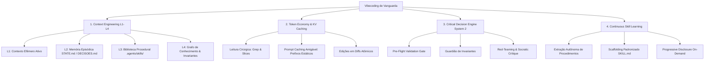

# 🪐 SISTEMA DE VIBECODING INTELIGENTE (NEXUS AGENT ENGINE)
### Arquitetura de Contexto Avançado, Economia de Tokens, Decisão Crítica e Aprendizado de Skills

O **Nexus Agent Engine** é uma infraestrutura de engenharia agêntica de vanguarda projetada para transformar o *Vibecoding* intuitivo em uma prática de altíssimo rigor de engenharia, eficiência de custos (FinOps de IA) e evolução cognitiva contínua.

---

## 🏛️ Os Quatro Pilares do Sistema



---

## 📁 Estrutura de Diretórios `.agents/`

```text
.agents/
├── README.md                          # Este documento mestre
├── rules/                             # Diretrizes e restrições automaticamente aplicadas
│   ├── 01_context_engineering.md      # Gerenciamento de contexto em 4 níveis (L1-L4)
│   ├── 02_token_economy.md            # FinOps de IA, KV-cache optimization e anti-bloat
│   ├── 03_critical_decision.md        # Portões de validação pre-flight e System 2 thinking
│   └── 04_vibe_orchestration.md       # Orquestração multi-agente e papéis especializados
├── invariants/
│   └── invariants.md                  # Invariantes inegociáveis do projeto (qualidade/performance)
├── roles/                             # Papéis especializados de subagentes
│   ├── vibe_architect.md              # Visão de arquitetura, contratos e invariantes
│   ├── precision_implementer.md       # Codificação cirúrgica, diffs limpos e zero regressões
│   ├── qa_critic.md                   # Verificação visual, testes de runtime e auditoria
│   └── memory_synthesizer.md          # Extração de skills, atualização de estado e descarte de ruído
├── skills/                            # Habilidades procedurais descobertas sob demanda
│   ├── skill-synthesizer/             # Sintetizador autônomo de novas skills
│   ├── penumbra-vj-guardian/          # Guardião especializado do motor VJ (Penumbra)
│   ├── midi-hardware-master/          # Conectividade MIDI Pro, Modos B1-B4 e Hardware Twin
│   └── context-audit/                 # Auditor de pegada de tokens e saúde do workspace
└── scripts/                           # Ferramentas executáveis CLI de suporte
    ├── synthesize_skill.py            # CLI para criar novas skills estruturadas
    ├── audit_tokens.py                # Script para medir pesos de arquivos e detectar inchaço
    └── preflight_check.py             # Script de validação de invariantes e saúde de runtime
```

---

## 🔄 Como Usar no Dia a Dia

1. **Início de Sessão:** O agente carrega automaticamente `AGENTS.md` / `GEMINI.md` e sincroniza o estado ativo lendo `STATE.md` e `DECISOES.md`.
2. **Durante o Código:** Nenhuma alteração destrutiva é feita sem antes passar pelo `Pre-Flight Gate` (validação de invariantes).
3. **Economia de Tokens:** Jamais leia arquivos gigantescos na íntegra; utilize `grep_search` e leituras por fatias (`StartLine`/`EndLine`).
4. **Após Dominar um Novo Fluxo:** Execute ou peça para o agente acionar o `skill-synthesizer` para registrar a nova técnica em `.agents/skills/<nova-skill>/SKILL.md`.
