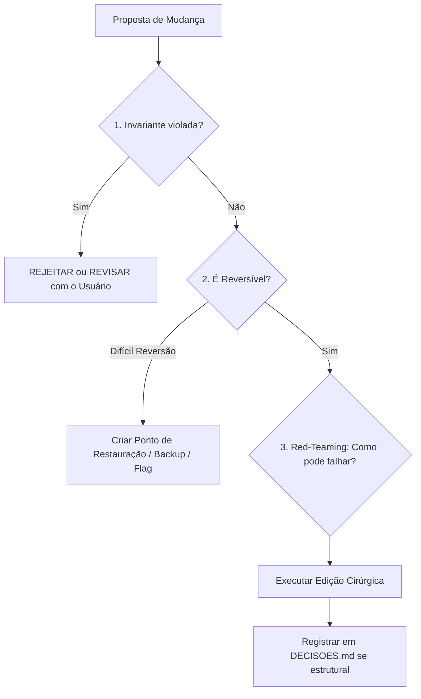

# ⚖️ REGRA 03: MOTOR DE DECISÃO CRÍTICA (SYSTEM 2 THINKING)

O maior perigo no *Vibecoding* ingênuo é a pressa stocástica: a IA propõe soluções que "parecem certas" no curto prazo, mas introduzem dívida técnica silenciosa, quebram contratos entre subsistemas ou violam os princípios artísticos e de performance.

Esta regra impõe um processo deliberativo de **System 2 Thinking** antes de ações de alto impacto.

---

## 🚦 O Portão de Validação Pre-Flight (Pre-Flight Gate)

Antes de executar alterações em arquivos de arquitetura central (ex: `app.js`, `server.js`, contratos OSC/NDI, pipeline de shaders), o agente deve rodar mentalmente ou explicitamente este checklist de 4 pontos:

### 1. Checagem de Invariantes (Invariant Check)
* A modificação quebra a taxa de 60 FPS no loop principal de animação?
* Introduz flashes brancos sólidos ou modos aditivos (`screen`, `add`) proibidos pelo briefing estético de penumbra?
* Deforma proporções de aspecto (Aspect Ratio) de vídeos ou mattes?
* Se **SIM**, a abordagem deve ser reconfigurada imediatamente.

### 2. Checagem de Reversibilidade (Reversibility Check)
* Mudanças devem ser fáceis de desarmar (ex: toggles booleanos em `appState`, flags de feature, ou novos métodos isolados).
* Evite reescrever refatorações massivas simultâneas sem testar cada etapa.

### 3. Red-Teaming Adversarial (Auto-Crítica Socrática)
* O agente deve perguntar a si mesmo:
  > *"Quais são os 2 cenários mais prováveis onde este código falhará em tempo de execução?"*
  *(Exemplo: áudio não conectado retornando NaN na frequência; textura de matte com CORS em requisição de imagem; divisão por zero no cálculo de aspect ratio).*
* O código deve incluir defensiva para esses dois cenários.

### 4. Registro Automático de ADR (Architectural Decision Record)
* Quando uma escolha técnica envolver trade-off significativo (ex: escolha de codec, protocolo de rede, biblioteca externa, técnica de blend):
  * Adicionar uma nova linha na tabela de [`DECISOES.md`](file:///Volumes/PLM_SSD_01/Pipeline%20SSD%2001/Gigantera/Pipeline%20Gigantera/Video%20Art%20Drinkzinho/DECISOES.md) com:
    * `Data/Hora` | `Decisão` | `Motivo Técnico / Artístico` | `Alternativa Descartada`
