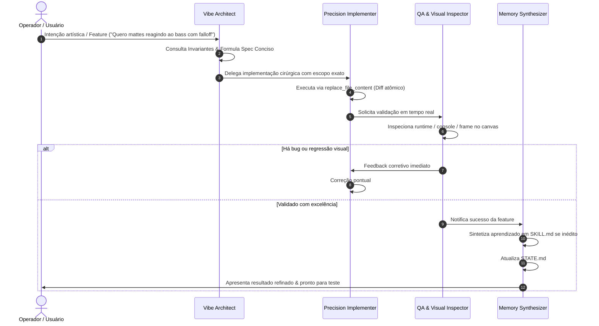

# 🎭 REGRA 04: ORQUESTRAÇÃO DE VIBECODING E PAPÉIS MULTI-AGENTE

O Vibecoding profissional de vanguarda não é um monólogo de um único modelo generalista sobrecarregado. Ele opera como um **sistema composto de inteligência (Compound AI System)** com papéis bem delineados e ciclo fechado de verificação (*closed-loop validation*).

---

## 👥 Especialização dos Papéis de Agentes

| Papel | Arquivo de Definição | Responsabilidade Primária |
|---|---|---|
| 🎯 **Vibe Architect** | [`.agents/roles/vibe_architect.md`](file:///Volumes/PLM_SSD_01/Pipeline%20SSD%2001/Gigantera/Pipeline%20Gigantera/Video%20Art%20Drinkzinho/.agents/roles/vibe_architect.md) | Concepção conceitual, definição de specs, controle de invariantes e registro de decisões em `DECISOES.md`. |
| ⚡ **Precision Implementer** | [`.agents/roles/precision_implementer.md`](file:///Volumes/PLM_SSD_01/Pipeline%20SSD%2001/Gigantera/Pipeline%20Gigantera/Video%20Art%20Drinkzinho/.agents/roles/precision_implementer.md) | Codificação cirúrgica, diffs atômicos, zero regressões e conformidade com o design system existente. |
| 🛡️ **QA & Visual Inspector** | [`.agents/roles/qa_critic.md`](file:///Volumes/PLM_SSD_01/Pipeline%20SSD%2001/Gigantera/Pipeline%20Gigantera/Video%20Art%20Drinkzinho/.agents/roles/qa_critic.md) | Testes no navegador/runtime, inspeção de console, verificação de frames renderizados e auditoria visual. |
| 🧠 **Memory Synthesizer** | [`.agents/roles/memory_synthesizer.md`](file:///Volumes/PLM_SSD_01/Pipeline%20SSD%2001/Gigantera/Pipeline%20Gigantera/Video%20Art%20Drinkzinho/.agents/roles/memory_synthesizer.md) | Extração de novas skills aprendidas, limpeza de ruído, atualização de `STATE.md` e otimização de tokens. |

---

## 🔁 O Ciclo de Execução Fechada (Closed-Loop Vibe Loop)

---

## 📐 Diretrizes Operacionais
1. **Especificação Breve antes de Código Complexo:** Nunca inicie uma modificação multissistema sem alinhar o plano conciso de passos (3 a 5 bullets).
2. **Validação Ativa com Ferramentas do Ambiente:** Se o sistema envolve browser, servidor ou After Effects, utilize as ferramentas disponíveis (`browser_subagent`, `run_command`, scripts de teste, logs) para verificar se está funcionando antes de dar a tarefa como encerrada.
3. **Persistência de Aprendizado:** Se uma solução exigiu resolução de bug complexo (ex: ajuste de aspect-fit em canvas HTML5 ou cálculo de módulo de posterize time), formalize como skill reutilizável.
